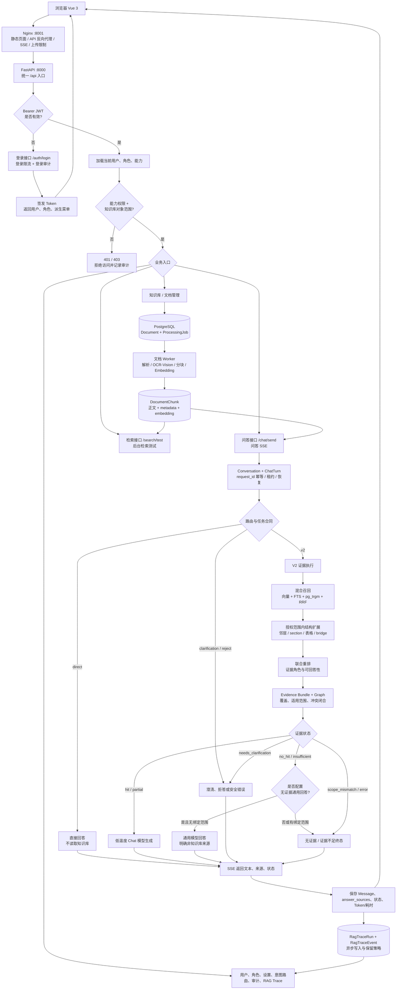
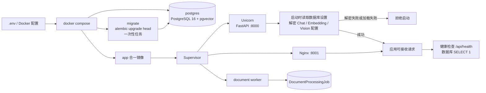
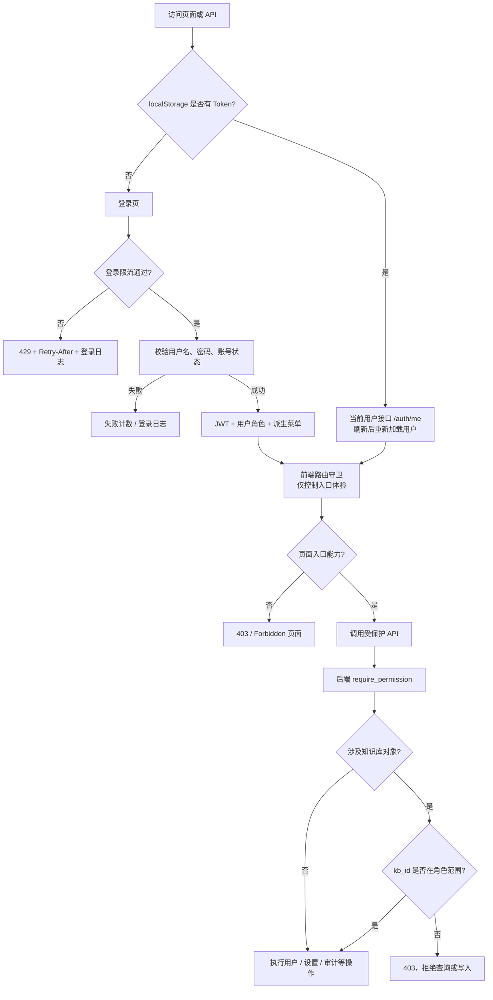
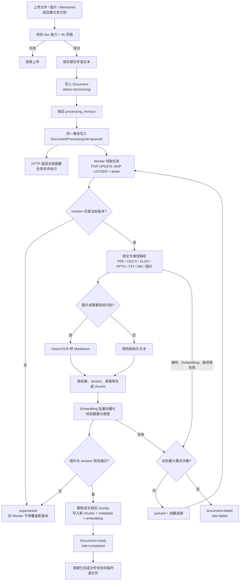
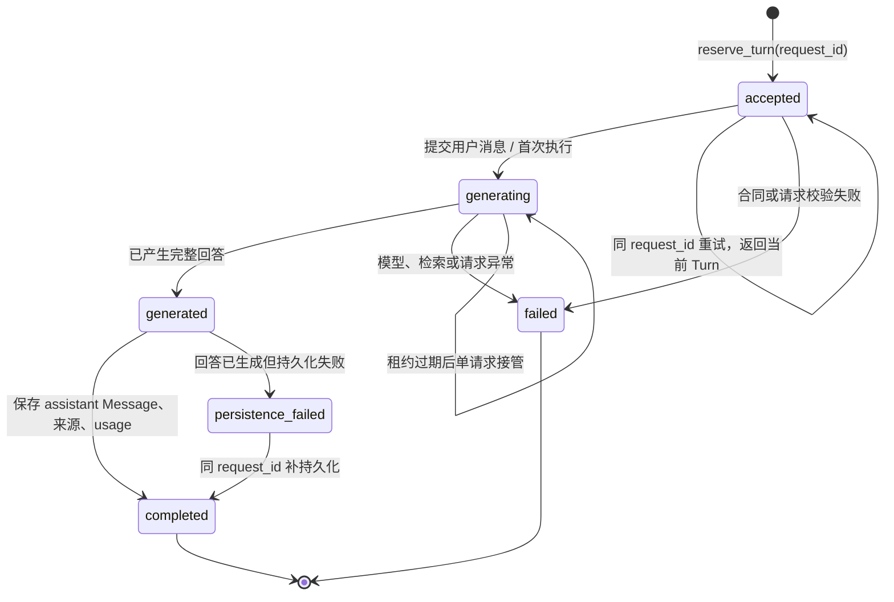
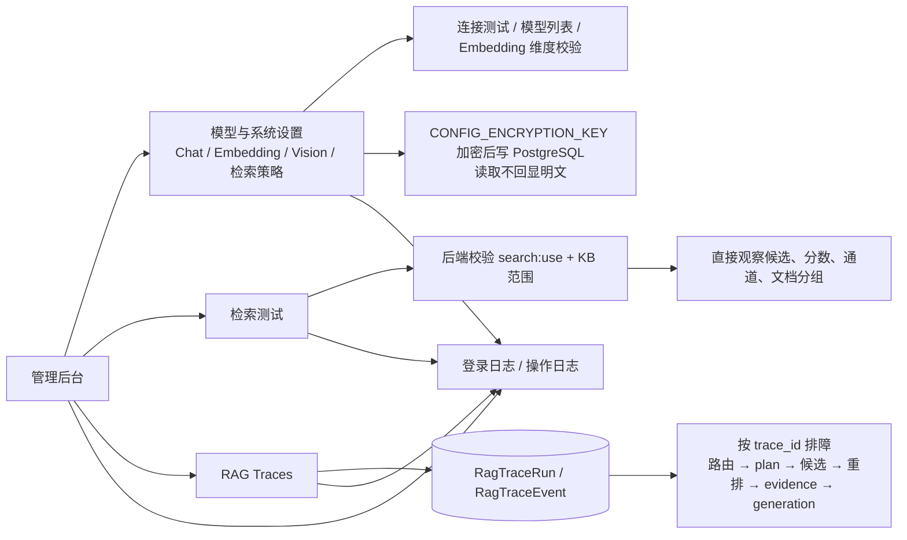
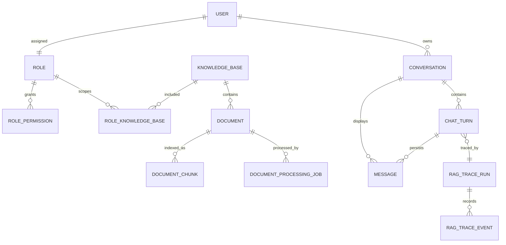

# RAG 知识库系统整体逻辑流程图

> 依据当前工作区源码、部署文件和已有架构说明整理。图中表示代码设计的运行链路，不等同于生产环境已经完成真实数据库、模型服务、浏览器 SSE 或部署验收。

## 1. 一张图看懂系统

## 2. 部署与启动流程

本地开发时，`postgres`、FastAPI、文档 Worker 和 Vite 前端可以拆开运行；上传接口只入队，不在 HTTP 请求内同步解析和向量化。相关实现见 [`docker-compose.yml`](../docker-compose.yml)、[`backend/main.py`](../backend/main.py) 和 [`backend/core/document_jobs.py`](../backend/core/document_jobs.py)。

## 3. 登录、菜单与后端授权

权限有两个正交维度：功能能力（如 `chat:use`、`kb:read`、`doc:create`）和知识库范围（`none`、`selected`、`all`）。前端隐藏菜单不能替代后端鉴权；文档原图同样必须走受保护接口。规范见 [`docs/RBAC权限模型.md`](RBAC权限模型.md)，实现主要在 [`backend/core/deps.py`](../backend/core/deps.py)、[`backend/core/permissions.py`](../backend/core/permissions.py) 和 [`backend/core/authorized_scope.py`](../backend/core/authorized_scope.py)。

## 4. 文档入库与索引流程

更新文档会递增 `processing_revision`；旧任务即使晚到也不能覆盖新内容。实现见 [`backend/api/document.py`](../backend/api/document.py)、[`backend/core/document_parser.py`](../backend/core/document_parser.py) 和 [`backend/core/document_jobs.py`](../backend/core/document_jobs.py)。

## 5. 一次问答的详细流程

```mermaid
flowchart TD
    Q[ChatView 输入问题<br/>selectedKbIds + search_config + request_id] --> SEND[POST /api/chat/send<br/>Bearer JWT]
    SEND --> PREAUTH[校验用户能力 chat:use<br/>校验全部 KB 在可访问范围]
    PREAUTH -- 失败 --> HTTP403[403，不进入检索]
    PREAUTH -- 成功 --> IDEMP{同一 request_id<br/>是否已有 ChatTurn?}
    IDEMP -- 是且已完成 --> REPLAY[复用已保存结果 / SSE 回放]
    IDEMP -- 是且租约过期 --> RECLAIM[加锁接管过期 Turn]
    IDEMP -- 否 --> RESERVE[reserve ChatTurn<br/>accepted + request_id]
    RECLAIM --> CONTEXT
    RESERVE --> CONTEXT[加载 Conversation 上下文<br/>历史候选、active task、pending clarification]
    CONTEXT --> PENDING{存在待澄清状态?}
    PENDING -- 是 --> CONTROL{取消 / 重复 / 选择范围 / 新问题?}
    CONTROL -- 取消或重复 --> CLARIFY[返回澄清控制结果]
    CONTROL -- 选择或细化 --> CONTRACT[重新构造当前请求合同]
    CONTROL -- 新问题 --> ROUTE
    PENDING -- 否 --> ROUTE[意图路由 + route/task contract]
    CONTRACT --> ROUTE
    ROUTE --> DECISION{执行决策}
    DECISION -- direct --> DIRECT[直接回答流<br/>不读取知识库]
    DECISION -- 不可执行 --> CLARIFY
    DECISION -- v2 --> PLAN

    PLAN[V2 查询计划<br/>answer requirements + bridge requirements + applicability scope] --> V3{V3 语义入口 active?}
    V3 -- 否 --> GRAPH[编译不可变 Retrieval Task DAG]
    V3 -- 是 --> CATALOG[服务器生成 source-span catalog]
    CATALOG --> SELECT[V3 只能选择 catalog span]
    SELECT --> FENCE{revision fence +<br/>权限/范围/合同校验?}
    FENCE -- 失败或超时 --> GRAPH
    FENCE -- 成功 --> SEMANTIC[编译语义与上下文<br/>后端重新加载授权来源]
    SEMANTIC --> GRAPH
    GRAPH --> TURN[accepted -> generating<br/>提交用户消息和 Turn 状态]
    TURN --> FIRST[先发 conversation_started SSE]
    FIRST --> RETRIEVE[按 DAG 执行检索任务]
    RETRIEVE --> CHANNELS[向量 / PostgreSQL FTS / pg_trgm]
    CHANNELS --> RRF[RRF 融合候选<br/>保留 doc/chunk/section/约束元数据]
    RRF --> EXPAND[有限结构扩展<br/>同文档邻居、section、表格兄弟、bridge answer]
    EXPAND --> RERANK[联合重排<br/>direct / related / irrelevant 与可回答性]
    RERANK --> EVIDENCE[Evidence Bundle + Evidence Graph<br/>验证 requirement 覆盖、范围、冲突、上下文预算]
    EVIDENCE --> STATUS{最终 evidence_status}
    STATUS -- needs_clarification --> CLARIFY
    STATUS -- scope_mismatch / error --> CLOSED[关闭生成<br/>返回明确失败状态]
    STATUS -- no_hit / insufficient --> FALLBACK{配置通用模型回退?}
    FALLBACK -- 否或有绑定范围 --> CLOSED
    FALLBACK -- 是且无绑定范围 --> GENERAL[通用模型生成<br/>answer_provenance=general_model]
    STATUS -- hit / partial / unverified --> GENERATE[知识库上下文 + 低温度 Chat 生成]
    GENERATE --> SSE[SSE：步骤、文本 delta、来源、状态、usage]
    GENERAL --> SSE
    CLARIFY --> SSE
    CLOSED --> SSE
    DIRECT --> SSE
    SSE --> SAVE[保存 assistant Message<br/>answer_sources / evidence_status / usage / duration]
    SAVE --> COMPLETE[ChatTurn=completed<br/>或 failed / persistence_failed]
    COMPLETE --> TRACE[Trace：request → route → plan → retrieval<br/>→ rerank → evidence → generation → response]
    TRACE --> UI[前端 Chat Store 更新消息、来源、澄清和 Turn 状态]
    UI --> NEXT[用户继续追问 / 查看历史 / 重试]
    NEXT --> SEND
    REPLAY --> UI
```

### 5.1 证据状态的含义

| 状态 | 含义 | 默认行为 |
| --- | --- | --- |
| `hit` | 证据完整闭合，可支持答案 | 进入知识库生成 |
| `partial` / `unverified` | 有可用内容，但存在降级或未完全验证 | 带状态生成，不能伪装完整 |
| `no_hit` | 没有可用命中 | 关闭生成，或按配置进入无证据通用回答 |
| `insufficient_evidence` | 命中相关，但不能覆盖全部要求 | 关闭生成，或按配置进入无证据通用回答 |
| `needs_clarification` | 产品、版本、项目等范围互斥或任务不完整 | 先澄清，不生成事实答案 |
| `scope_mismatch` | 证据不属于请求的适用范围 | 关闭生成 |
| `error` | 检索、模型或执行阶段异常 | 记录错误并结束本轮 |

V2 只接收已授权的 KB ID 和后端编译的任务合同；V3 不能选择权限、KB、执行开关或凭空创造事实。实现见 [`backend/api/chat.py`](../backend/api/chat.py)、[`backend/core/rag_v2/query_plan.py`](../backend/core/rag_v2/query_plan.py)、[`backend/core/rag_v2/task_graph.py`](../backend/core/rag_v2/task_graph.py)、[`backend/core/rag_v2/pipeline.py`](../backend/core/rag_v2/pipeline.py) 和 [`backend/core/retriever.py`](../backend/core/retriever.py)。

## 6. ChatTurn、澄清与断线恢复

澄清状态保存在 `Conversation.pending_route_state`，并带 `route_state_revision/state_id`。用户选择后，服务端重新校验当前 KB/document allow-list；撤权、文档失效或状态版本变化时，不回退到未授权的全库检索。前端会在 SSE 中恢复 `trace_id`、`turn_id`、澄清状态和来源。相关实现见 [`backend/core/chat_turns.py`](../backend/core/chat_turns.py)、[`backend/core/clarification.py`](../backend/core/clarification.py)、[`backend/core/conversation_context.py`](../backend/core/conversation_context.py)、[`frontend/src/stores/chat.js`](../frontend/src/stores/chat.js) 和 [`frontend/src/utils/chatStream.js`](../frontend/src/utils/chatStream.js)。

## 7. 后台检索、配置与可观测性

前端结果面板区分“候选片段”和“实际进入生成上下文的采用片段”；后端 Trace 才是排障事实来源。排查回答不准时，优先沿 `trace_id` 检查路由、查询计划、授权候选覆盖、重排淘汰、Evidence Graph 和实际生成上下文，而不是直接调大 `top_k`。

## 8. 核心数据关系

核心模型集中在 [`backend/models/db_models.py`](../backend/models/db_models.py)：知识库与文档负责可检索内容，`DocumentChunk` 保存正文、结构 metadata 和向量；`Conversation/ChatTurn/Message` 负责会话与幂等；`RagTraceRun/Event` 负责问答调用链与诊断。

## 9. 阅读这套流程时需要保持的边界

- “前端入口隐藏”不等于授权；所有受保护 API 仍由后端能力和对象范围共同校验。
- “检索命中”不等于“可以回答”；只有 Evidence Graph 覆盖要求并通过范围、冲突和上下文校验，才进入知识库生成。
- “V3 选择了语义”不等于“V3 可以执行”；V3 结果必须通过 revision fence，由后端编译成 V2 合同。
- “本地测试通过”不等于“生产链路验收”；外部 PostgreSQL/pgvector、Chat/Embedding/Vision、真实权限数据和浏览器 SSE 仍需单独验证。
- 当前结构化检索来自 chunk metadata、section、邻居和表格扩展，不应误称为已经具备 PageIndex 式独立章节树 Agent。

## 10. 依据与验证范围

本图以当前 [`docs/系统架构与运行链路.md`](系统架构与运行链路.md) 为概览基线，并对入口源码、文档 Worker、RAG V2 pipeline、前端路由与 SSE 工具做了静态交叉检查。本次只新增本文件，不修改业务代码；未在本次任务中执行生产数据库迁移、真实模型调用、Docker 发布或浏览器验收。
